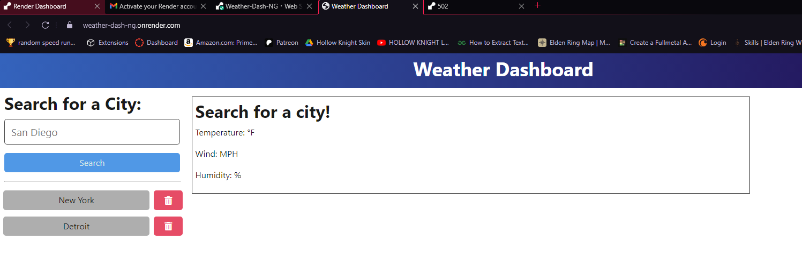

# Weather Dashboard

    

## Description

  A weather dashboard application that calls the OpenWeather API and renders data in the browser. It allows a user to look up the current weather and a five day forecast for a specified city.

## Table of Contents

* [Description](#description)
* [Dependencies](#dependencies)
* [Installation](#installation)
* [Usage](#usage)
* [Contributing](#contributing)
* [License](#license)
* [Questions](#questions)

## Dependencies

This project relies on the following dependencies:

* **Express.js**: Used for building the web application
* **Day.js**: Used for date and time manipulation
* **Bootstrap**: Used to style the application
* **FontAwesome**: Used to import fonts

## Installation

**Prerequisites:**

* Node.js and npm (or yarn) installed.

**Steps:**

1. Clone this repository
2. `cd` into your project folder
3. Install the dependencies by runnning `npm install`
4. Start the application by running `npm start:dev`

This will allow you to test and deploy changes locally without impacting the live deployment of the application.

## Usage

### Core Functionality

* Get the current weather for a city by searching for the city by name
* Get a five day forecast for a city by searching for the city by name
* Store a search history of cities you searched for in the past
* Get the weather of cities in your search history
* Remove cities from your search history

The application is hosted on Render here: <https://weather-dashboard-wpxv.onrender.com/>

## Contributing

**Feel Free to contribute!**

**Reporting Issues:**

1. Search the existing issues to see if your issue has already been reported.
2. If not, create a new issue on our GitHub issue tracker.
3. Please provide as much detail as possible, including steps to reproduce the issue and expected behavior.

**Contributing Code:**

1. Fork the repository.
2. Create a new branch for your feature or bug fix.
3. Make your changes and commit them.
4. Push your changes to your fork.
5. Create a pull request to the main branch.

## License

  This project is licensed under MIT. For more information, see (<https://opensource.org/licenses/MIT>)

## Questions

  **GitHub**: [nolangrossi](https://github.com/nolangrossi)
  
  For any questions, please contact me at: <nolangrossi6@gmail.com>
